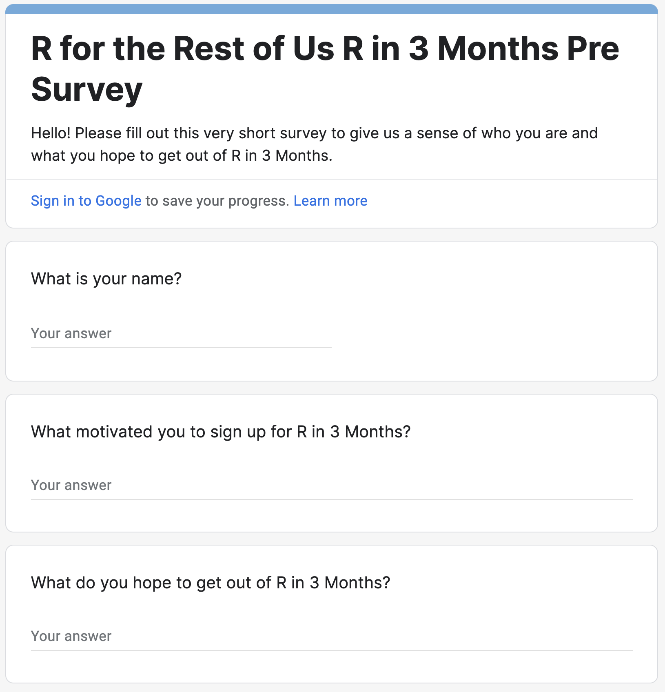
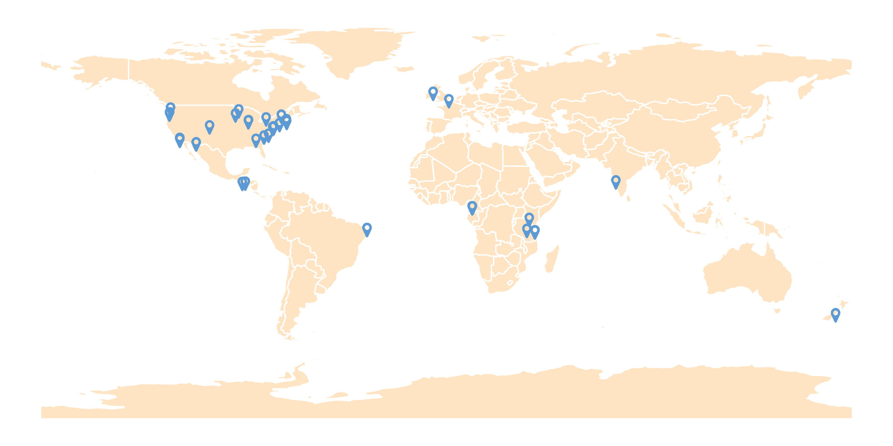
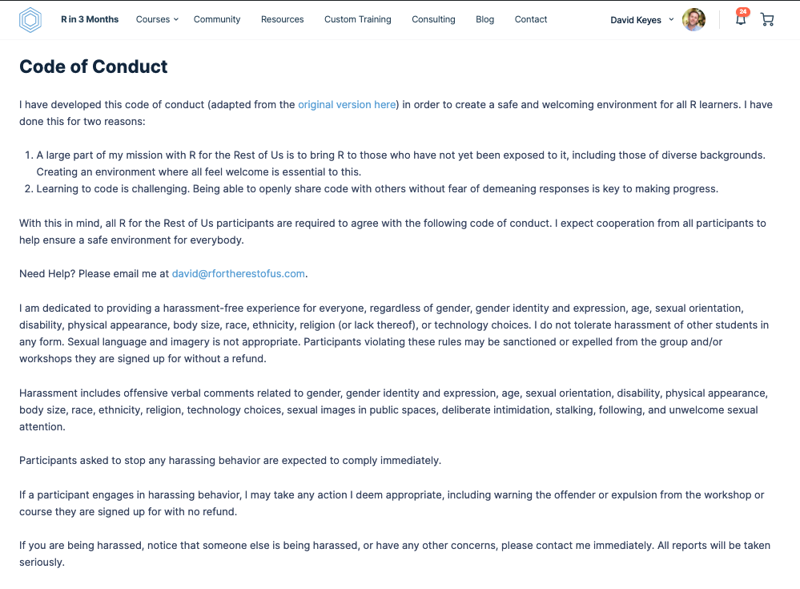
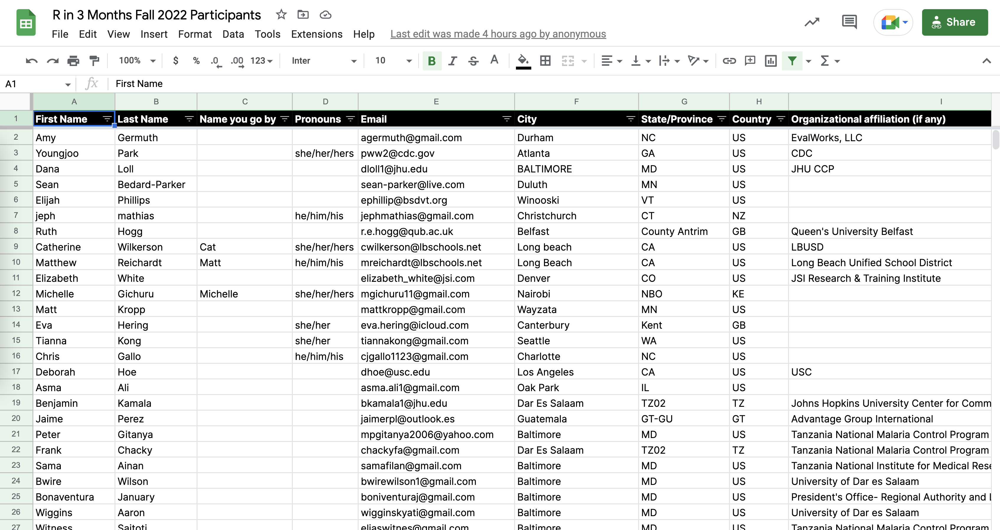
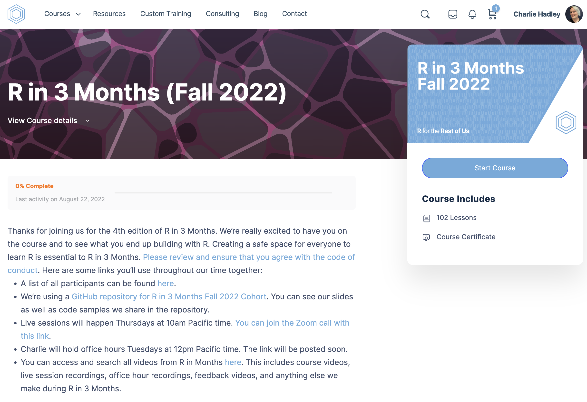

```{r setup, include=FALSE}
knitr::opts_chunk$set(eval = FALSE, 
                      warning = FALSE,
                      message = FALSE,
                      rows.print = 5)
library(tidyverse)
library(googlesheets4)
library(lubridate)
library(janitor)
library(hrbrthemes)
library(scales)
library(tidygeocoder)
library(rnaturalearthdata)
library(sf)
library(emojifont)

world_sf <- countries110 %>% 
  st_as_sf()
```


# Agenda

--

1. Welcome

--

1. Logistics

--

1. Weekly Plan

--

1. Questions on Getting Started with R

--

1. Next Week


---

# Survey

If you haven't yet completed the pre-survey, [please do so now](https://docs.google.com/forms/d/e/1FAIpQLSdRWALRAzMBCYKMVTCeNx4B8uh9LF8LU2xZZfY4IyDqvOZ8aw/viewform?usp=sf_link).

<center></center>

---


class: center, middle, inverse

# Welcome

---

class: center, middle, inverse

## Introductions

---

class: center, middle

## David Keyes


---

class: center, middle 

## Charlie Hadley


---

class: center, middle 

## Who Are You?

---

### Where are you from?

```{r, echo=FALSE, eval=TRUE}
participants_2022_fall <- read_sheet("https://docs.google.com/spreadsheets/d/1lD5SgbdG24HfV4Glo80u7j7I3o-XpRJESYcQ50eXbEc/edit#gid=0") %>% 
  clean_names()

geocoded_participants <- participants_2022_fall %>% 
  select(city, country) %>% 
  geocode(city = city,
          country = country,
          method = "iq")

gg_participants_map <- ggplot() +
  geom_sf(data = world_sf,
          fill = "bisque",
          color = "white",
          size = 0.5) +
  geom_text(data = geocoded_participants %>%
              mutate(fa_icon = fontawesome("fa-map-marker")),
            aes(label = fa_icon,
                x = long,
                y = lat),
            color = "#5B9AD5",
            family='fontawesome-webfont', size = 15) +
  theme_void()

ggsave(here::here("slides", "images", "map-students.png"),
       gg_participants_map,
       width = 10,
       height = 5)
```



---

### How often have folks used R so far?

```{r, eval=TRUE, echo=FALSE}
pre_survey <- read_sheet("https://docs.google.com/spreadsheets/d/19Ny92IGg0ZzIqiLs7QywaGF-Y85HQZn1iIIXN4I_tpg/edit?resourcekey#gid=1201619159") %>% 
  clean_names()
```


```{r, eval=TRUE, echo=FALSE, fig.width=12, fig.height=4, dpi=300}
pre_survey_fall_2020 <- pre_survey %>% 
  mutate(year = year(timestamp)) %>% 
  filter(timestamp > ymd("2022-08-01"),
         timestamp < ymd("2022-12-31"),
         ! `what_is_your_name` %in% c("David Keyes", "David")) %>% 
  mutate(how_much_have_you_used_r = factor(how_much_have_you_used_r,
                                           levels = c("Never", "Very Infrequently", "Occasionally", "Frequently")))

pre_survey_fall_2020 %>% 
  select(how_much_have_you_used_r) %>% 
  count(how_much_have_you_used_r) %>% 
  ggplot(aes(x = n,
             y = how_much_have_you_used_r)) +
  geom_col(fill = "#6cabdd") +
  labs(title = "How often have you used R?",
       y = "",
       x = "") +
  theme_ipsum(base_family = "Inter Regular") +
  theme(plot.title.position = "plot",
        panel.grid.major.y = element_blank()) +
  scale_x_continuous(breaks = pretty_breaks(2))
```

---

### Expertise with using R for dataviz

```{r, eval=TRUE, echo=FALSE, fig.width=12, fig.height=4, dpi=300}
data_viz_expertise <- pre_survey_fall_2020 %>% 
  select(how_would_you_rate_your_level_of_expertise_working_with_r_for_data_visualization) %>% 
  count(how_would_you_rate_your_level_of_expertise_working_with_r_for_data_visualization) %>%
  rename(data_viz_expertise = how_would_you_rate_your_level_of_expertise_working_with_r_for_data_visualization) %>% 
  right_join(tibble(data_viz_expertise = 1:10)) %>% 
  mutate(data_viz_expertise = as.character(data_viz_expertise)) %>% 
  mutate(data_viz_expertise = fct_relevel(data_viz_expertise, as.character(1:10))) %>% 
  mutate(data_viz_expertise = fct_recode(data_viz_expertise, "1\nNovice" = "1", "10\nExpert" = "10"))

data_viz_expertise %>% 
  ggplot(aes(y = n,
             x = data_viz_expertise)) +
  geom_col(fill = "#6cabdd") +
  scale_y_continuous(breaks = pretty_breaks(3)) +
  labs(title = "How would you rate your level of expertise with using R for Data Viz?",
       y = "",
       x = "") +
  theme_ipsum(base_family = "Inter Regular") +
  theme(axis.text.x = element_text(face = "bold"),
        panel.grid.major.x = element_blank(),
        panel.grid.minor.y = element_blank())
```

---

### How do you feel about the process of learning R?

```{r, eval=TRUE, echo=FALSE, fig.width=12, fig.height=4, dpi=300}
how_terrified <- pre_survey_fall_2020 %>% 
  select(on_a_scale_from_terrified_to_excited_how_do_you_feel_about_the_process_of_learning_r) %>% 
  count(on_a_scale_from_terrified_to_excited_how_do_you_feel_about_the_process_of_learning_r) %>%
  rename(how_terrified = on_a_scale_from_terrified_to_excited_how_do_you_feel_about_the_process_of_learning_r) %>% 
  right_join(tibble(how_terrified = 1:10)) %>% 
  mutate(how_terrified = as.character(how_terrified)) %>% 
  mutate(how_terrified = fct_relevel(how_terrified, as.character(1:10))) %>% 
  mutate(how_terrified = fct_recode(how_terrified, "1\nTerrified" = "1", "10\nExcited" = "10"))

how_terrified %>% 
  ggplot(aes(y = n,
             x = how_terrified)) +
  geom_col(fill = "#6cabdd") +
  scale_y_continuous(breaks = pretty_breaks(2)) +
  labs(title = "How do you feel about the process of learning R?",
       y = "",
       x = "") +
  theme_ipsum(base_family = "Inter Regular") +
  theme(axis.text.x = element_text(face = "bold"),
        panel.grid.major.x = element_blank(),
        panel.grid.minor.y = element_blank())
```

---

## Breakout Rooms

--

Share with the people in your breakout room: 

--

- Name

--

- Pronouns

--

- Location

--

- Organization

--

- Where you hope to be in 3 months

---

class: center, middle, inverse

# Logistics

---

## Code of Conduct


???

https://rfortherestofus.com/code-of-conduct/

---

## All of the Pieces

--

1. Live sessions Thursdays at 10am Pacific

--

1. Drop-in Sessions / Office hours Tuesdays at 12pm Pacific

--

1. [Course materials](https://rfortherestofus.com/courses/r-in-3-months-fall-2022/)

--

1. Course assignments

--

1. Project assignments

--

1. [Google Sheet with contact information etc](https://docs.google.com/spreadsheets/d/1lD5SgbdG24HfV4Glo80u7j7I3o-XpRJESYcQ50eXbEc/edit?usp=sharing)


---

## Google Sheet with Contact Info etc

[](https://docs.google.com/spreadsheets/d/1lD5SgbdG24HfV4Glo80u7j7I3o-XpRJESYcQ50eXbEc/edit?usp=sharing)

---

## Course Materials

[](https://rfortherestofus.com/courses/r-in-3-months-fall-2022/)


---

## Project Assignments

--

- Something you will work on throughout the three months we work together

--

- Can be something you're working on now or something you've done before

--

- To apply what your learn to your project you **will need a dataset that you can share with us**.

--

- Best if you have some "final report" you can work toward at the end of our 3 months together


---

## Advice on project datasets

If you can't share your datasets (or don't have any) you could try looking at [Tidy Tuesday datasets](https://github.com/rfordatascience/tidytuesday).

???

Get Charlie to chime in on ideas for data etc

---

## Project Assignment Feedback

You'll share progress most weeks and get feedback videos from Charlie

???

Explain motivation

---

## Project Assignment Submission


---

## Live Sessions

[Thursdays at 10:00am Pacific time](https://us02web.zoom.us/j/86453661896?pwd=VWN3VVVqenJpU1BzSUo3b3Zpd2N4UT09)

--

- Answer questions

--

- Live coding

--

- Group exercises

--

- And more!

--

Sessions will be recorded and made available within 24 hours


---

## Drop-in Sessions / Office Hours

[Tuesdays at 12:00PM Pacific time](https://us02web.zoom.us/j/85743952145?pwd=eXBRNXBCRDNhUU9STXVYWW5NT29SQT09)

--

- Charlie available for any questions

--

- They will be recorded and made available

---

class: inverse, center, middle

# Weekly Plan

---

## Thursday

--

- Live session

---

## Friday

--

- Live session video posted

--

- Summary email sent out

---

## Monday

--

- Reminder email sent out 

---

## Tuesday

--

- Office hours 12:00pm Pacific time

--

- Complete lessons and post any questions

--

- Complete project assignment


---

class: center, middle, inverse

# Getting Started Questions

???

- Tidyverse loading message
- read.csv vs read_csv
- How often to update packages

---

class: center, middle, inverse

# Next Week

---

## RMarkdown

--

R's Killer Feature!


---

## Course Assignment

- If you have questions specific to the lesson, post them below the lesson

--

- If you have more general questions, email David and Charlie and we'll create additional lessons to answer your questions

---

## Project Assignment

--

- Write the introduction to your report in RMarkdown

--

- Create a GitHub account

--

- Post your code as a [gist](http://gist.github.com/)

--

- Charlie will give you feedback


