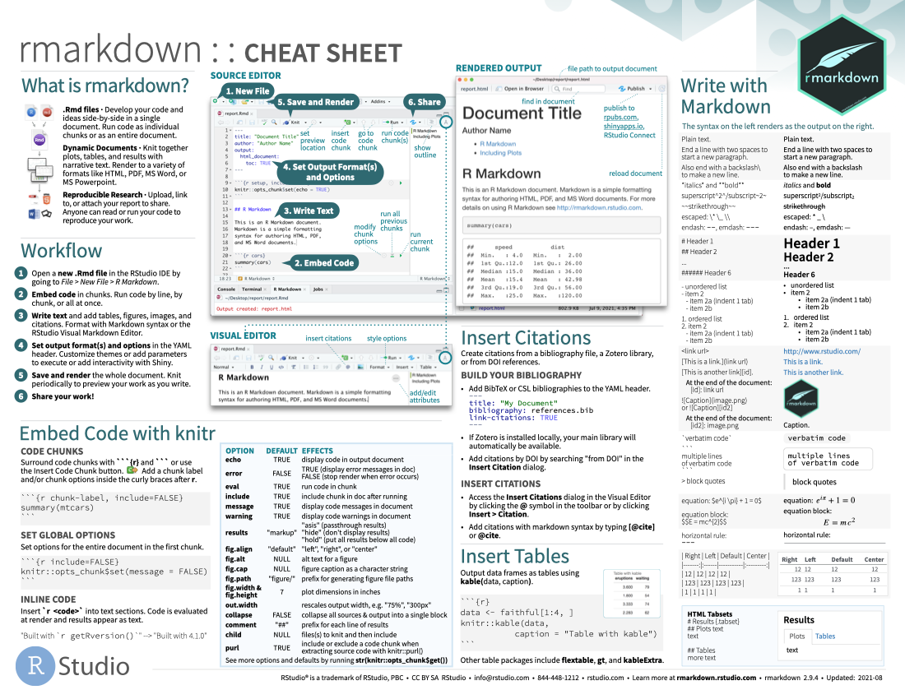
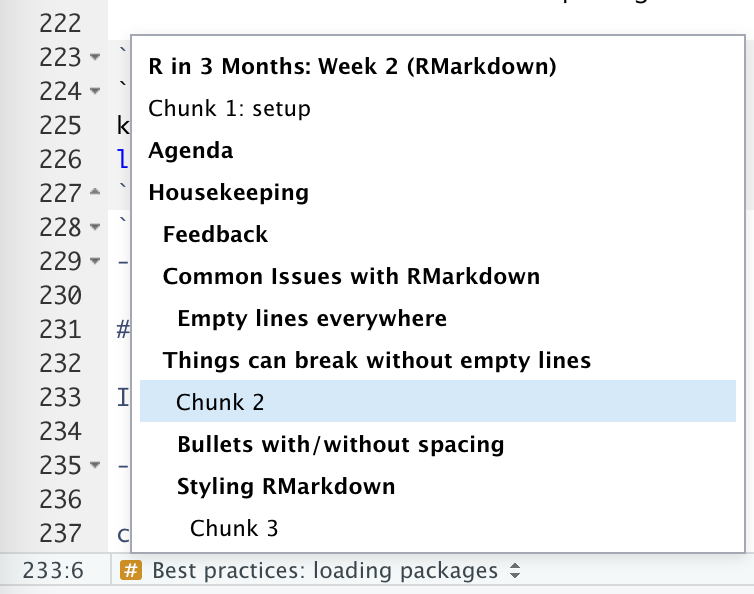

```{r setup, include=FALSE}
knitr::opts_chunk$set(
	echo = TRUE,
	message = FALSE,
	warning = FALSE
)
library(tidyverse)
```


# Agenda

--

1. Housekeeping

--

1. Whole group: discuss common issues, visual editor, and cheatsheets

--

1. Project datasets

--

1. Quarto

--

1. Next Week

---

class: inverse, center, middle

# Housekeeping

---

## Feedback

You should be getting emails when we post feedback

--

You can see everyone's feedback here: https://rfortherestofus.com/r-in-3-months-feedback-fall-2022/

???

- Hopefully you've received an email with your feedback, let us know if that's not working

- You can see everyone's feedback on the feedback page.

---

class: inverse, center, middle

## Common Issues with RMarkdown


---

### Empty lines everywhere

The language behind RMarkdown is called Markdown, and it's very fussy about spacing.

For it to work perfectly you should add an empty line between **everything**.

This includes bullet points.

---

## Things can break without empty lines

```{yml}
---
title: "Report"
output: html_document
---
# Bechdel Test
The Bechdel test is a simple test of whether a film has women with agency: 
- Does the movie contain 2 characters who are women
- Are they named
- Do they have a conversation about something other than man (or further the plot line of a man)
In this report we'll look at whether it's common to see movies that fail the test. 
```

---

### Bullets with/without spacing

... without spacing bullets look scrunched up

````
- Bullet point one
- Second bullet point
````

- Bullet point one
- Second bullet point

--

... adding an empty line adds the same spacing as you'd see in paragraphs of text.

````
- Bullet point one

- Second bullet point
````

- Bullet point one

- Second bullet point

---

### Styling RMarkdown

The way you style the text (images and spacing!) in your RMarkdown document depends on your output type:

.pull-left[
```{yaml}
---
title: "My report"
output: 
  html_document:
    css: charlie-styles.css
---
```
]

.pull-right[
```{yaml}
---
title: "My report"
output:
  word_document:
    reference_docx: charlie-styles.docx
---
```
]

<br>

There's a [new lesson about CSS and reference documents](https://rfortherestofus.com/courses/r-in-3-months-fall-2022/lessons/styling-rmarkdown-docs/) for styling RMarkdown reports.

---

### Addendum: The visual editor

Since the course was recorded there's now a WYSIWYG visual editor for RMarkdown documents!

--

Unfortunately, the visual editor does not work with ALL RMarkdown output formats.

---

### Addendum: Cheatsheets

.pull-left[

RStudio have created several [extremely useful cheatsheets, including one for RMarkdown](https://www.rstudio.com/resources/cheatsheets/).

]

.pull-right[

]

---

class: inverse, center, middle

# Other feedback

---

# Other feedback

- Where do `cars` and `pressure` come from?

- Best practices for:

  - Loading packages
  
  - Code chunk names
  
  - Obtaining data from the web

---

## Where do `cars` and `pressure` come from?

> Where do the data for cars and for pressure come from? I don’t see them in the getting-started-master folder, nor in the faketucky dataset. summary(cars) is clearly calling that data, but I don’t see how.

--

- When we upon up RStudio it loads up what we call "base R" - a collection of packages that everyone has and are crucial to the R "experience".

- That's why there are functions like `mean()` available to use without loading any packages.

- The `cars` and `pressure` objects both come from the `{datasets}` package which is part of base R... the package contains 100+ datasets!

---

## Best practices: loading packages

Always load your packages at the top of your RMarkdown documents.

An RMarkdown document should be designed from top to bottom.

You can choose whether to load packages in the setup code chunk or a separate chunk

````{verbatim}
```{r setup, include=FALSE}
knitr::opts_chunk$set(echo = TRUE)
library(tidyverse)
```
````
---

## Best practices: naming code chunks

.pull-left[

Naming code chunks makes your document more structured and easier to navigate.

At the bottom of the document is a button that allows you to navigate through the headings and code chunks.

- Code chunk names **are required** for creating internal cross-references.

- Only include the following characters in code chunk names

  - Letters
  
  - Numbers
  
  - Dashes
  
  - NEVER include spaces in code chunk names.

]

.pull-right[

]

---

### Best practices: obtaining data from the web

The most reproducible way to work with data from the web is to write a separate R script to download the file to your project.

Your RMarkdown document can then read in the *local* version of the file.

### But!!

--

This is only good advice if your data file doesn't change over time.

---

# RStudio Projects

Always use RStudio projects!

<div class="muse-video-player" data-video="cXFZUsM" data-logo="0" data-width="600"></div><script src="https://muse.ai/static/js/embed-player.min.js"></script>


---

class: inverse, center, middle

# Breakout Groups

---

## Breakout Groups

1. Look at the gist at [rfor.us/noknit](https://rfor.us/noknit). Figure out why it's not knitting. 

--

1. Look at the RMarkdown document at [rfor.us/rmdknit](https://rfor.us/rmdknit). Guess what will happen when you knit it, then knit it and see if you were right. Discuss why/why not.

---

class: inverse, center, middle 

## Project Data Sets

---

## Adding data files to Gists

While we're using gists in the course we're limited to data files being .csv files.

--

You can add a .csv file by dragging it into your gist.

--

Once we've introduced GitHub we can progress to working with Excel files (and any other file types).

---

## Picking a project dataset

As mentioned in the previous week, we're asking you to work with a dataset that's interesting/means something to you.

While we continue working with Gists we need you to work with .csv files. You might choose to work with a different dataset to begin with and switch later on.

---

## SPSS Datasets

--

We often have folks working with labelled .SAV (SPSS) files.

--

To properly import these into R requires a [little bit of code](https://gist.github.com/charliejhadley/5e023be42089c9bf42d75b2f5b129b64).

--

In the follow-up email to this week's live session we'll provide you some resources about this and will bring this subject up again later in the course.

---

## Tidy Tuesday

The [Tidy Tuesday project](https://github.com/rfordatascience/tidytuesday) provides over 100 datasets covering all sorts of subjects:

- [Kenyan Census data](https://github.com/rfordatascience/tidytuesday/blob/master/data/2021/2021-01-19/readme.md)

- [Plastic Pollution](https://github.com/rfordatascience/tidytuesday/blob/master/data/2021/2021-01-26/readme.md)

- [Video Games](https://github.com/rfordatascience/tidytuesday/blob/master/data/2021/2021-03-16/readme.md)

- [Deforestation](https://github.com/rfordatascience/tidytuesday/blob/master/data/2021/2021-04-06/readme.md)

- [Survivor TV Show](https://github.com/rfordatascience/tidytuesday/blob/master/data/2021/2021-06-01/readme.md)

- [Paralympics](https://github.com/rfordatascience/tidytuesday/blob/master/data/2021/2021-08-03/readme.md)

---

class: inverse, center, middle

# Quarto...

---

### Quarto is the next generation of RMarkdown

.pull-left[

Quarto is a new technology that will be the future of RMarkdown.

It's not **quite** stable enough for us to switch our teaching materials from RMarkdown to Quarto.

> And RMarkdown is **not** going away. RMarkdown will continue to be supported and developed into the future.

]

.pull-right[


]

---

### Why does Quarto exist?

.pull-left[

RMarkdown is quite limited in that it's only useful for folks in the R community.

Quarto is designed from the ground up to work for R, Python and Julia users.

It's very exciting - but we feel it's worthwhile having some caution about learning it right now.
]

.pull-right[


]

---

### Where to find out more about Quarto

.pull-left[

[Tom Mock](https://twitter.com/thomas_mock) from Posit gave a [great 2h workshop on Quarto](https://www.youtube.com/watch?v=yvi5uXQMvu4) we'd recommend.

Actually using Quarto is not much different from RMarkdown

````{verbatim}
---
title: "Untitled"
format: html
---

Everything's the same except:

- We use `format` instead of `output` in the YAML header

- Code chunk options are written differently

```{r}
#| echo: false
rep("lots of cats", 5)
```
````


]

.pull-right[


]


---

## ... oh, and about RStudio

.pull-left[

RStudio have also rebranded themselves to Posit.

This is because they want to add other people to our community who don't use R.

- The RStudio application is not changing name

- Posit are dedicated to the R community!!

]

.pull-right[


]


---

class: inverse, center, middle

# Next Week

---

## For Next Week

1. Complete data wrangling and analysis lessons in Fundamentals

--

1. Do some simple data analysis using your data and add it to your report

--

1. Post your code as a [gist](http://gist.github.com/)

--

1. Post the URL to your gist in the Week 3 Project Assignment Lesson


