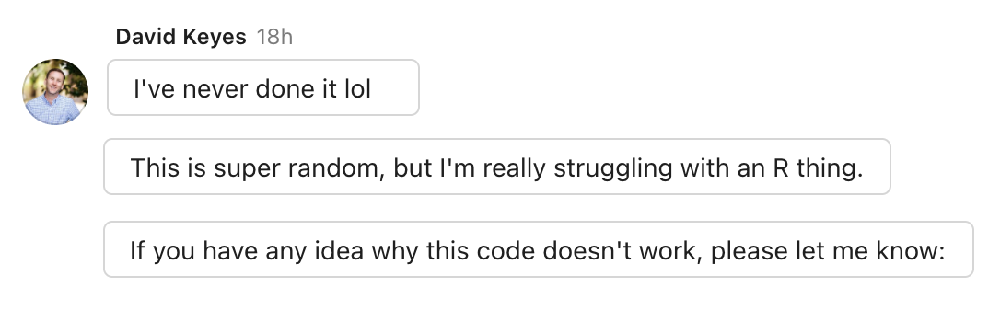

```{r, include=FALSE, eval = TRUE}
options(htmltools.preserve.raw = FALSE)
library("tidyverse")
library("wakefield")
library(palmerpenguins)
library(janitor)
```


# Agenda

--

1. Housekeeping

--

1. Tips from feedback

--

1. Group Work

--

1. Next Week

---

# Housekeeping

--

- Office hours recap

--

- Questions on project assignments?

--

- Other logistics questions? 

--

- Catch-up weeks


---

class: inverse, center, middle

# Tips from feedback

---

# Tips from feedback

- read_csv() vs read.csv()

- NA values in R

- %in% operator

- Quotes

- Assigning vs displaying

- Typos happen to everyone


---

## read_csv() vs read.csv()

- It understands empty cells as NA automatically

- It's smarter! It will more often detect complex data types

- It's **much** faster.


---

## How R handles NA

--

SPSS has named NA values

--

In R, a value is only NA if it shows up in light gray


---

## How R handles NA

```{r eval = TRUE}
penguins
```

---

## How R handles NA

```{r eval = TRUE}
penguins %>% 
  mutate(not_actually_na = "NA")
```


---

## How R handles NA

--

> NA in the R language explicitly means missing. If you have an Excel worksheet with empty cells then these will become NA when imported into R. The drop_na() function will drop all rows which contain an NA, but can target specific columns by naming them , eg drop_na(shipment_date).

---

## NA values

First, remember that you can use the `na` argument in the `read_csv()` function.

--

```{r eval = FALSE}
my_data <- read_csv("my-data.csv",
                    na = c("999", "9999")) #<<
```


---

## NA values

We were asked about replacing NA values in datasets.

The `{tidyr}` package provides two really useful functions for doing this

- `replace_na()` will replace existing `NA` values with your chosen values

- `na_if()` will replace values you specify with `NA`

---

## replace_na()

```{r}
msleep %>% 
  select(name, conservation) %>% 
  mutate(conservation = replace_na(conservation, "unknown"))
```

---

## na_if()

```{r}
starwars %>%
  select(name, eye_color) %>%
  mutate(eye_color = na_if(eye_color, "unknown"))
```


---

## %in% operator


> I’m wondering if you know why one needs to concatenate multiple observations in the filter function. For example, here’s a correct use of filter:

> `filter(marital_status %in% c(“Divorced”, “Separated”, “Widowed”))`

> From what I understand of the concatenate function (from Excel), wouldn’t that basically mean R is looking at each observation in marital_status and seeing if that observation can be found anywhere inside “DivorcedSeparatedWidowed”? But when I try it without concatenating by doing this:

> `filter(marital_status %in% (“DivorcedSeparatedWidowed”))`

> I get an error message. Maybe the answer is “That’s just how R works,” but I’m trying to build a solid mental model for these functions, so if there’s anything more to it, I’d love to better understand. Thanks!


---

## Assigning vs displaying

--

This displays the results of the code

```{r}
penguins_raw %>% 
  clean_names()
```

---

## Assigning vs displaying

But then in the next code chunk, `penguins_raw` hasn't changed:

```{r}
penguins_raw 
```

---

## Assigning vs displaying

We have to assign the results of our code to use them later on:

```{r}
penguins_good_names <- penguins_raw %>% 
  clean_names()
```

```{r}
penguins_good_names
```


---

## Quotes

> Could you please go over the use of “quotes” around a term. When are quotes required, and when are they not necessary? For example, quotes are used here – select(contains(“hlth_bad”)). But no quotes are used here – select(marital_status, education).

---

## Why doesn't this work?

```{r eval = FALSE}
penguins %>% 
  summarize(mean_bill_length = mean(bill_length_mm,
                                    na.rm = TRUE)) %>% 
  summarize(mean_bill_depth = mean(bill_depth_mm,
                                    na.rm = TRUE))
```

---

# Typos happen to everone

.pull-left[

]

.pull-right[
```{r eval = FALSE}
library(tidyverse)
library(tidycensus)
library(janitor)

get_acs(year = 2019,
        geography = "county",
        geometry = TRUE,
        state =  "OR",
        variables = "B01003_001") %>% 
  clean_names() %>% 
  mutate(
    name = str_remove(name, " County")) %>% 
  rename(poulation = estimate,
         county = name) %>% 
  select(county, population)
```

]

---

# Group Work


Create a new RStudio project

--

Download the penguins.csv file and add it to your project

--

Copy the penguins report RMarkdown document into RStudio and save as an RMarkdown file

--

Fill out the blank code chunks to create your report

--

Make sure you can knit your document!

---


# Next Week

--

1. Course assignment: complete data viz lessons

--

1. Project assignment: make a graph from your data
