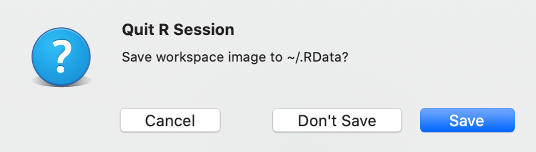
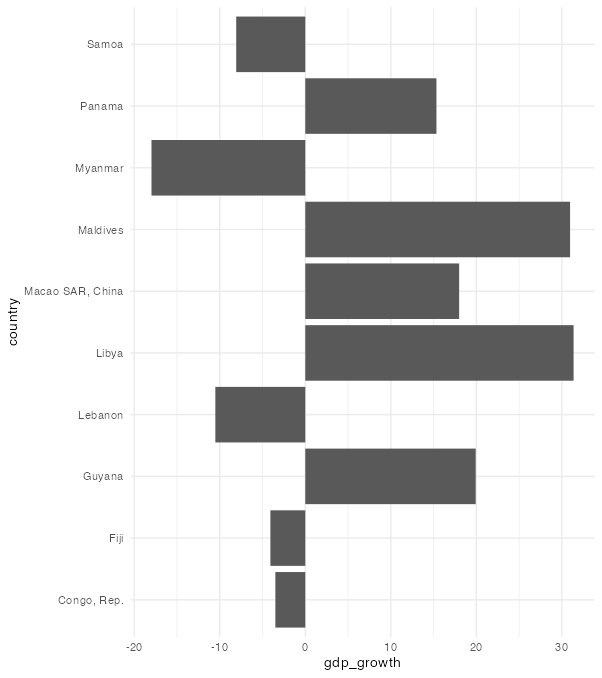

```{r eval=TRUE, message=FALSE, warning=FALSE, include=FALSE}
options(htmltools.preserve.raw = FALSE)
knitr::opts_chunk$set(message = FALSE,
                      warning = FALSE)
library("tidyverse")
library("wakefield")
library(palmerpenguins)
library(lubridate)
library(janitor)
library(hrbrthemes)
library(gt)
```


# Agenda

--

1. Housekeeping

--

1. Tips from feedback

--

1. Data Viz Examples

--

1. Next Week

---

# Housekeeping

--

- Next week we won't have a live session, but you can book a one-to-one with Charlie - [rfor.us/charliechat](https://rfor.us/charliechat)

---

class: inverse, center, middle

# Tips from feedback

---

# Tips from feedback

- One output per code chunk

- Updating columns

- Making nice % columns

- Save source, not workspace

---

# Limit code chunks to one output

RMarkdown is a completely new skill set. When we start out it feels like we can use code chunks to do multiple things.

```{r, eval=FALSE}
msleep %>% 
  count(vore)
  gt()

msleep %>% 
  group_by(vore) %>% 
  summarise(mean_sleep = mean(sleep_total, na.rm = TRUE))
  gt()
```

However, it's advised that **one code chunk displays one thing in the output document**.

---

# Limit code chunks to one output

When we start naming code chunks it makes sense to restrict code chunks to one output


```{r, table-count-diet, eval = FALSE}
msleep %>% 
  count(vore)
  gt()
```


```{r, table-diet-mean-sleep, eval = FALSE}
msleep %>% 
  group_by(vore) %>% 
  summarise(mean_sleep = mean(sleep_total, na.rm = TRUE))
  gt()
```


This also helps us if we choose to use internal cross-referencing in more complex reports.

---

## Updating columns

There's a base R way of doing things

```{r, eval=FALSE}
your_data$question_12 <- as.numeric(your_data$question_12)
```

... and there's the tidyverse way of doing things

```{r, eval=FALSE}
your_data <- your_data %>% 
  mutate(question_12 = as.numeric(question_12))
```

---

## Making nice % columns

The `tabyl()` and `adorn_*()` functions from `{janitor}` are useful for quick summaries.

--

The `{scales}` package provides functions for formatting all sorts of numbers

```{r}
library(scales)
```


```{r}
percent(0.3)
```

--

```{r}
percent(1)
```

---

## Making nice % columns


```{r}
dollar(20)
```

--

```{r}
dollar(2000000)
```


---

## Save Source, not Workspace

Why do we not want to reload our data when we start RStudio? 



---

class: center, middle

[](https://rstats.wtf/save-source.html)

Source: [rstats.wtf](https://rstats.wtf/save-source.html)


---

class: inverse, center, middle

# Data Viz Examples

---

## Charlie Data Viz Example


  
---

## Oregon by the Numbers Example


???

tfff.org/obtn


---

# Data Visualization Questions

What questions do you still have? 

---

# Next Week

--

1. `r emo::ji("desert_island")` Catch up week. `r emo::ji("desert_island")`

--

1. No additional assignments, but please complete anything you're behind on

--

1. No live session

--

1. Office hours **will** happen

--

1. Book a one-to-one session with Charlie: [rfor.us/charliechat](https://rfor.us/charliechat)


