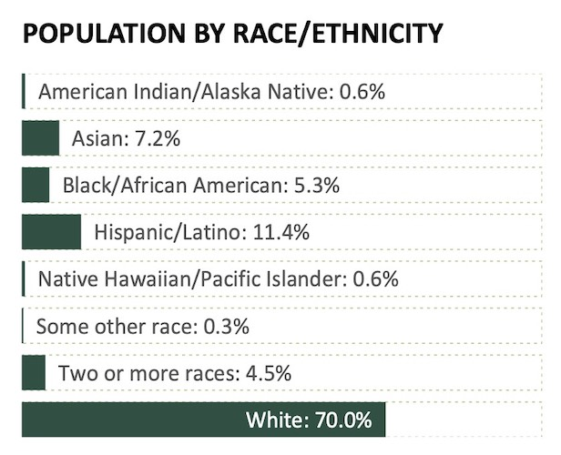

```{r eval=TRUE, message=FALSE, warning=FALSE, include=FALSE}
options(htmltools.preserve.raw = FALSE)
knitr::opts_chunk$set(message = FALSE,
                      warning = FALSE)
library("tidyverse")
library("wakefield")
library(palmerpenguins)
library(lubridate)
library(janitor)
library(hrbrthemes)
```


# Agenda

--

1. Housekeeping

--

1. Four Tips

--

1. Data Viz Examples

--

1. Next Week

---

# Housekeeping

--

- Next week we won't have a live session, but you can book a one-to-one with Charlie

---

class: inverse, center, middle

# Four Tips

---

## `reshape2`

This is an example of an old function

--

Check out newer packages such as `dplyr` and `tidyr` for equivalents

--

In this case, the equivalent would be `pivot_longer()`/`pivot_wider()`

---

class: center, middle


From [Learning R: A Conversation](https://urban-institute.medium.com/learning-r-a-conversation-982130d75104)

---

## data$column vs mutate()

You'll often find this code on the web [or your colleague's machines]:

```{r}
msleep$name <- str_to_title(msleep$name)
```

This is base R syntax.

It's really useful to be able to convert this to tidyverse code:

```{r, eval=FALSE}
msleep %>% 
  mutate(name = str_to_title(name))
```

---

### ... okay, but why mutate()

Using `mutate()` instead of `data$col` syntax, you can create pipes rather than constantly assigning things

```{r}
msleep_clean <- msleep
msleep_clean$name <- str_to_title(msleep_clean$name)
msleep_clean$sleep_cycle <- round_half_up(msleep_clean$sleep_cycle)
msleep_clean
```

---

### ... okay, but why mutate()

```{r}
msleep_clean <- msleep %>% 
  mutate(name = str_to_title(name)) %>% 
  mutate(sleep_cycle = round_half_up(sleep_cycle))

msleep_clean
```


---

## rename() vs mutate()

If you want to change the name of an existing column you can use rename()

```{r}
msleep %>% 
  rename(species = name)
```

---

## coord_flip()

Before March 2020 the only way to create a horizontal bar chart with {ggplot2} was `coord_flip()`

```{r, fig.width=8, fig.height=4}
penguins %>% 
  count(island) %>% 
  ggplot(aes(x = island,
             y = n)) +
  geom_col() +
  coord_flip()
```

---

## coord_flip()

But now you can simply provide your aes() in horizontal format

```{r, fig.width=8, fig.height=4}
penguins %>% 
  count(island) %>% 
  ggplot(aes(x = n,
             y = island)) +
  geom_col()
```

???

---

## Save Source, not Workspace

Why do we not want to reload our data when we start RStudio? 

---

class: center, middle

[](https://rstats.wtf/save-source.html)

Source: [rstats.wtf](https://rstats.wtf/save-source.html)


---

class: inverse, center, middle

# Data Viz Examples

---

## Formatting numbers with {scales}

Juliana Machado asked about formatting the labels in this chart:

```{r echo=FALSE, fig.height=2.5, message=FALSE, warning=FALSE, dpi=150}
library(tidyverse)
library(scales)

census_population_clean <- read_csv(here::here("data", "data-juliana-week-4.csv"), col_types = "cncccc" )

table_status <- census_population_clean %>%
  group_by (estcivil, legal_marital_status) %>% 
  summarize(mean_age = round(mean(age, na.rm = TRUE),0),
            var_age = round(var(age, na.rm=TRUE),1),
            cv = percent(sd(age, na.rm = TRUE) / mean(age, na.rm=TRUE)),
            quantity = n()) %>% 
  arrange(estcivil)

table_status %>% 
  ggplot(aes(x=reorder(legal_marital_status, mean_age), y=quantity)) +
  geom_col(fill= "lightblue4") + 
  xlab("") +
  ylab("Quantity") +
  labs(title="Population - Quantity for marital status")+
  geom_text(aes(label = quantity), vjust = -0.2)+
  theme_minimal() 
```


---

## Ordering facets

Michael Steinhoff created a chart faceted by year, in your charts the facet order might require **factors**.

```{r echo=FALSE, message=FALSE, warning=FALSE}
library(janitor)
ma_hdd <- read_csv(here::here("data", "mike-data-week-3.csv"),
                   na = c("No gas", "Municipal", "Protected","")) %>% 
  clean_names()

# reshape2!
ma_hhd_long <- ma_hdd %>% 
  pivot_longer(jan:annual, names_to = "month")

ma_hdd_town_monthly <- ma_hhd_long %>% 
  filter(location != "All Towns") %>% 
  filter(month != "annual")


ma_hdd_town_monthly %>% 
  group_by(year, month) %>% 
  summarise(month_total = sum(value, na.rm = TRUE)) %>% 
  ggplot(aes(y = month,
             x = month_total)) +
  geom_col() +
  facet_wrap(~ year)

```

---

# facet_wrap(scales = "free")

Sandra Obradovic used a faceted bar chart. 

Due to the wildly different number of categories in each facet I recommended using 

```{r, eval=FALSE}
facet_wrap(~gender, scales = "free_x")
```


```{r echo=FALSE, message=FALSE, warning=FALSE, out.width='400p', dpi=150, out.height='300px'}
data <- read_csv(here::here("data", "data-sandra-week-4.csv")) %>%
  clean_names()

wellbeing_by_gender_edu <- data %>% 
  group_by(education, gender) %>% 
  summarize(wellbeing = mean(wellbeing)) %>% 
  drop_na()

ggplot(wellbeing_by_gender_edu,
       mapping = aes(x = education,
       y = wellbeing,
       fill = gender))+
  geom_col()+
  facet_wrap(~gender)
```

---

# ggplot2 extensions

Lisa Thalheimer discovered the awesome {ggridges} package for comparing continuous distributions:

```{r echo=FALSE, message=FALSE, warning=FALSE}
library(ggridges)
IDP <- readr::read_csv(here::here("data", "data-lisa-week-4.csv")) %>% 
  clean_names() %>% 
  select(month_end, year_week, current_arrival_region, previous_departure_region, reason:number_of_individuals) %>%
  mutate(month_end = dmy(month_end)) %>% 
  mutate(year = year(month_end)) %>%
  # mutate(week_number = week(month_end)) %>% 
  mutate(month = month(month_end, label = TRUE))


IDP %>% 
  count(month, current_arrival_priority_need, reason) %>% 
  ggplot() +
  geom_density_ridges_gradient(aes(x = n,
                                   y = month,
                                   fill = stat(x))) +
  scale_fill_viridis_c(direction = -1, guide = "none") +
  labs(title="IDPs tend to experience more food security during extreme weather vs conflict",
       y = "Priority needs of IDPs", x = "2016-2021") +
  theme_ipsum(base_size = 8) +
  facet_wrap(~reason,
             scales = "free_x") +
  theme(plot.title = element_text(size = 4),
        axis.title.y = element_text(hjust = 0.75))
```

---

class: inverse, center, middle

# Workflow Advice

---

## Charlie Data Viz Example

---

## Oregon by the Numbers Example



---

# Data Visualization Questions

What questions do you still have? 

---

# Next Week

--

1. `r emo::ji("desert_island")` Catch up week. `r emo::ji("desert_island")`

--

1. No additional assignments, but please complete anything you're behind on

--

1. No live session

--

1. Office hours **will** happen

--

1. Book a one-to-one session with Charlie: [rfor.us/charliechat](https://rfor.us/charliechat)


