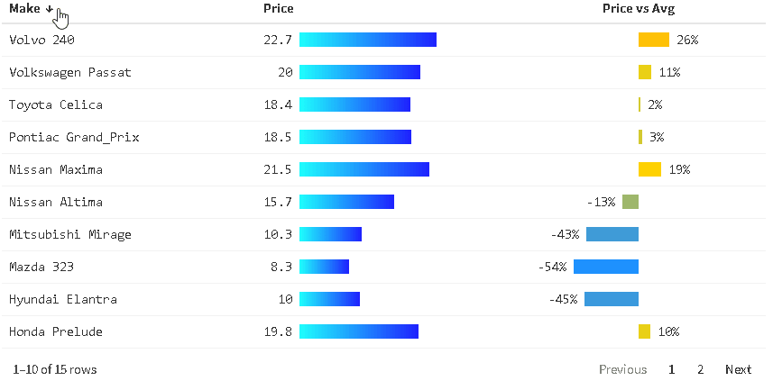

```{r setup, include=FALSE, eval = TRUE}
options(htmltools.preserve.raw = FALSE)
knitr::opts_chunk$set(message = FALSE,
                      warning = FALSE)
library("tidyverse")
library("wakefield")
library(palmerpenguins)
library(janitor)
library(ggtext)
```


<!---- PLAN

THESE SLIDES USE sli.do FOR POLLS!

USE THIS LINK: https://app.sli.do/event/ndcJPnZgvf18CgCbCp93hn/live/polls

--->

```{r}

```

# Agenda

--

1. Housekeeping

--

1. Tips from feedback

--

1. GitHub

--

1. Next Week

---

# Housekeeping

--

- Catch-up Week

--

---

class: inverse, center, middle

# Tips from feedback

---

## Making beautiful tables in Rmd

While there's one package we recommend for charts (`ggplot2`)... the package landscape is more complicated for tables.

David has written a [great blogpost comparing the most widely used packages](https://rfortherestofus.com/2019/11/how-to-make-beautiful-tables-in-r/).

--

.pull-left[

#### Interactive Tables

- [{DT}](https://rstudio.github.io/DT/) is very easy to start with and is somewhat flexible.

- [{reactablefmtr}](https://kcuilla.github.io/reactablefmtr/index.html) extends {reactable} to allow you to build beautiful and highly interactive tables.

<center></center>

]

--

.pull-right[

#### Printable tables

- [{gt}](https://gt.rstudio.com/) is the most general purpose and flexible solution for making charts. It relies on HTML and CSS.

- [{flextable}](https://davidgohel.github.io/flextable/index.html) is the solution if you need to output to Word documents. We've also found it useful for tables that need to span multiple pages.

]

---

## Why are my columns too big?

Some folks have asked why their bar charts are too large.

```{r, include=FALSE}
bmi_data <- read_csv(here::here("data", "bars-too-long.csv"))
```

.pull-left[
```{r, eval=FALSE}
bmi_data %>% 
  ggplot(aes(x = heart_disease,
             y = avg_bmi)) +
  geom_col() +
  facet_wrap(~ sex)
```
]

.pull-right[
```{r, eval=TRUE, echo=FALSE, out.height='450px'}
bmi_data %>% 
  ggplot(aes(x = heart_disease,
             y = avg_bmi)) +
  geom_col() +
  facet_wrap(~ sex)
```
]

---


The `geom_bar()` geom does counting for us - bars length are calculated from counting how many observations there are:

.pull-left[
```{r, out.height='300px'}
msleep %>% 
  ggplot(aes(x = vore)) +
  geom_bar()
```
]

.pull-right[

```{r, out.height='300px'}
msleep %>% 
  count(vore) %>% 
  ggplot(aes(x = vore,
             y = n)) +
  geom_col()
```

]

---

## mutate() and across()

Sometimes you want to do the same thing to many columns.

This can be achieved by combining `mutate()` with `across()`.

---

## Converting many columns at once

```{r}
iris %>% 
  as_tibble()
```

---

## Converting many columns at once

```{r}
iris %>%
  as_tibble() %>%
  mutate(across(c(Sepal.Length, Sepal.Width), round_half_up))
```

---

## Formatted text in charts

Later in the course we'll introduce the `ggtext` package that will allow us to use HTML in {ggplot2} chart elements.

```{r, echo=TRUE, eval=FALSE}
ggplot(data = penguins,
       aes(x = flipper_length_mm,
           y = bill_length_mm)) +
  geom_point() +
  labs(title = "Penguins are *really cool*")
```

```{r, out.width='300px', echo=FALSE}
ggplot(data = penguins,
       aes(x = flipper_length_mm,
           y = bill_length_mm)) +
  geom_point() +
  labs(title = "Penguins are *really cool*") +
  theme(plot.title = element_markdown(size = 30))
```

???

I think it’s worth telling the students to abandon any stackoverflow question that mentions using expression() for formatting text


---

class: inverse, center, middle

# Git + GitHub

???

---

## Save files first

If you don't save your files first, you can't commit them

---

## GitHub Desktop

The git tab in RStudio is great, it will suit most of your needs.

GitHub Desktop provides some additional tools and capabilities that might be useful for more advanced users.

--

If you can't get RStudio and git to work together then consider trying GitHub Desktop instead.

---

## Editing files in the browser on GitHub

The GitHub website gives you the ability to edit files directly.

Technically, this is exactly the same as making a commit.

Remember you will need to **pull** the changes onto your local machine.

---

## Other things you can do with Git and GitHub

--

How we publish slides every week

--

How we use issues

---

class: inverse, center, middle

## Git + GitHub Questions


---

# Next Week
<!-- Charlie's example video was built with this gist https://gist.github.com/charliejhadley/b2bc9af0853779093f1ce7308687ef48 -->

--

1. Advanced data wrangling

--

1. The main thing to make sense of is the concept of tidy data (it's a hard concept, but worth the effort to figure it out!)

--

1. No project assignment next week

--

1. Time change


