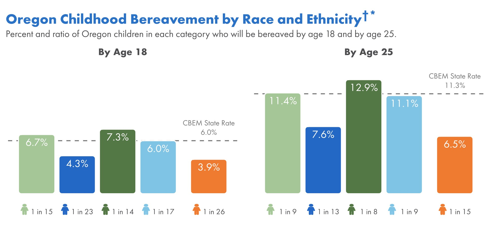

```{r, include=FALSE, eval = TRUE}
options(htmltools.preserve.raw = FALSE)
library(tidyverse)
library(readxl)
library(janitor)
library(tweetrmd)
```


# Agenda

--

1. Housekeeping

--

1. Example of High-Quality Data Viz

--

1. Next Week

---

class: inverse, center, middle

# Housekeeping

---

## Remaining Schedule

- Week 10 (2022/11/17): Official Assignment Amnesty!

- Week 11 (2022/12/01): Advanced data viz, part 2

- Week 12 (2022/12/08): Advanced RMarkdown

- Week 13 (2022/12/15): Wrap-up

---

## 1:1 with Charlie

Folks are still booking in their first 1:1 session due to time constraints and how popular popular both VSA R and R in 3 Months has been.

We've decided to offer you a 2nd 1:1 session with Charlie in January - [2nd 1:1 with Charlie](https://savvycal.com/charliejhadley-r-for-the-rest-of-us/2nd-1to1-jan-2023)

This will provide you the opportunity to use some of what you've learned before booking in your 1:1.

---

## Deadline for Feedback

Charlie will provide feedback for submissions made before December 31

--

You'll have access to materials FOREVER

---

class: inverse, center, middle

# Examples of High-Quality Data Viz

---

## CBEM Bar Charts



---

# Next Week

--

Catch-up Week: Official assignment amnesty

--

Please submit anything you're working on at any point


