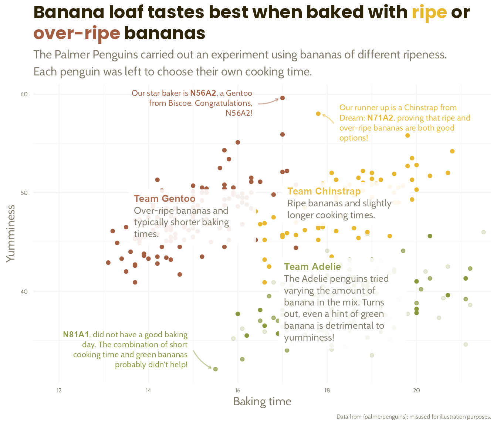

```{r, include=FALSE, eval = TRUE}
options(htmltools.preserve.raw = FALSE)
library(tidyverse)
library(fivethirtyeight)
library(readxl)
library(janitor)
library(patchwork)
library(here)
library(gapminder)
library(ggtext)
```


# Agenda

--

1. Housekeeping

--

1. `ggtext` example

--

1. Group work

--

1. Next week

---

class: inverse, center, middle

# Housekeeping


---

## 1:1 with Charlie

[Book another 1:1 with Charlie in January](https://savvycal.com/charliejhadley-r-for-the-rest-of-us/2nd-1to1-jan-2023)


---

## Remaining Schedule

--

- Week 12

  - Office hours
  
  - Live session (December 8th)
  
--
  
- Week 13

  - Office hours
  
  - Last Live session (December 15th)

--

- Assignments

  - Please submit before end of December

---

class: inverse, center, middle

# Example Data Viz with `{ggtext}`

---

## Dumbbell charts and {ggtext}

.pull-left[
Let's walk through building this beautiful chart from [Stephanie Evergeen](https://stephanieevergreen.com/easy-dot-plots-in-excel/) in {ggplot2}.

This is a dumbell chart that uses colour in the title in place of a legend. We can do this using {ggtext}

]

.pull-right[

]

---

## Doing even more with `{ggtext}`

.pull-left[

Our colleague Cara Thompson ran an incredible workshop at NHS-R in November 2022 about levelling up your charts [with {ggtext}].

<br>

You can watch the video and view Cara's slides [on her website](https://www.cararthompson.com/talks/nhsr2022-level-up).

]

.pull-right[

]


---

class: inverse, center, middle

# Group work

---

## Group work

--

Your task is decipher how I made [this graph](https://share.rfor.us/v1ub7qWe)


--

- Why is the y aesthetic property set to 1?

--

- What does shape = 124 do?

--

- What does geom_hline() do in this viz?

--

- Why do I have to specifically add x axis text using the line `theme(axis.text.x = element_text(color = "grey80")`)?

--

[Link to starter code](https://gist.githubusercontent.com/dgkeyes/8e6ae05003dac8fc6a928a9d1230f955/raw/d23ea91d8a7f2d5f1c10ce410a39ca057daba268/data-viz-exercise.R)


---

# Next Week

--

Course assignment: Complete lessons on advanced RMarkdown

