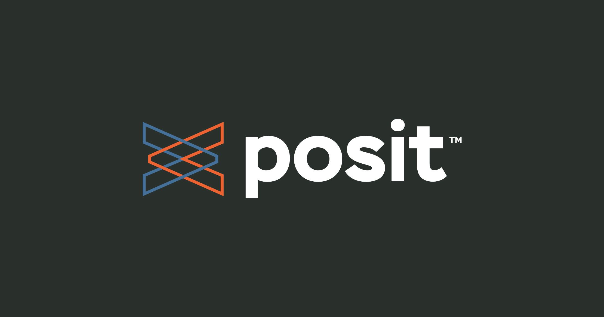

```{r, include=FALSE, eval = TRUE}
options(htmltools.preserve.raw = FALSE)
library(tidyverse)
library(fivethirtyeight)
library(readxl)
library(janitor)
library(patchwork)
library(here)
library(gapminder)
library(ggtext)
```


# Agenda

1. Housekeeping

--

1. What else can RMarkdown do?

--

1. Quarto

--

1. Final assignment: show us what you can do!

--

1. Final week: let's see what you did!

---

class: inverse, center, middle

# What else can RMarkdown do?

---

## RMarkdown can do a lot...

We've seen that you can make the following:

--

.pull-left[

- HTML reports

- PDF reports

- Word reports

... but there's a lot more.
]

--

.pull-right[

- Beautiful books with `bookdown`

- Beautiful reports with `pagedown`

- Beautiful slides with `xaringan`

- Programmatically generated reports

- Dashboards (... and even shiny apps!)

- Websites all in RMarkdown!


]

---

## Beautiful books with `bookdown`

.pull-left[
The `bookdown` package was used for writing R for Data Science and many other extremely useful R books.
]

.pull-right[


]

???

https://rfortherestofus.com/2022/04/bookdown/


---

## Beautiful reports with `pagedown`

.pull-left[
The `pagedown` package is designed to simplify designing documents you need to print.

Instead of learning `LaTeX` you can use HTML and CSS!

]

.pull-right[
<center></center>
]

---

## `pagedreport`

.pull-left[
R for the Rest of Us has created a package called [`pagedreport`](https://pagedreport.rfortherestofus.com/) that adds several templates to `pagedown`.

]

.pull-right[
<center></center>
]


---

class: inverse, center, middle

## Websites created all in RMarkdown

---

## `distill` for websites (and blogs)

Using `distill` is the easiest way to create a fully functioning data blog with RMarkdown.

--

We'll put together a thorough discussion thread about this.


---

## Parameterized reports

Use [parametrized RMarkdown reporting](https://bookdown.org/yihui/rmarkdown/parameterized-reports.html) to make a separate report for each region

```{yaml}
---
params:
  state: "Alaska"
title: "`r params$state` Report"
---
  
```

```{r eval = FALSE}
qualitative_data %>% 
  filter(state == params$state)
```

???

https://rfortherestofus.com/2020/10/parameterized-reporting-with-rmarkdown/

---

class: inverse, center, middle

# Quarto...

---

### Quarto is the next generation of RMarkdown

.pull-left[

Quarto is a new technology that will be the future of RMarkdown.

It's not **quite** stable enough for us to switch our teaching materials from RMarkdown to Quarto.

> And RMarkdown is **not** going away. RMarkdown will continue to be supported and developed into the future.

]

.pull-right[


]

---

### Why does Quarto exist?

.pull-left[

RMarkdown is quite limited in that it's only useful for folks in the R community.

Quarto is designed from the ground up to work for R, Python and Julia users.

It's very exciting - but we feel it's worthwhile having some caution about learning it right now.
]

.pull-right[


]

---

## ... oh, and about RStudio

.pull-left[

RStudio have also rebranded themselves to Posit.

This is because they want to add other people to our community who don't use R.

- The RStudio application is not changing name

- Posit are dedicated to the R community!!

]

.pull-right[


]

---

### Where to find out more about Quarto

.pull-left[

[Tom Mock](https://twitter.com/thomas_mock) from Posit gave a [great 2h workshop on Quarto](https://www.youtube.com/watch?v=yvi5uXQMvu4) we'd recommend.

Actually using Quarto is not much different from RMarkdown

````{verbatim}
---
title: "Untitled"
format: html
---

Everything's the same except:

- We use `format` instead of `output` in the YAML header

- Code chunk options are written differently

```{r}
#| echo: false
rep("lots of cats", 5)
```
````


]

.pull-right[


]

---

# Final Week

Charlie will host her office hours as usual at 12pm Wednesday.

--

In the final live session we'll cover:

- What resources to use next.

- How to ask reproducible questions with {reprex}

- Highlighted assignment submissions from **you folks**!

---

class: inverse, center, middle

## Final assignment:<br>Show us what you can do!

---

### Final assignment

We'd love to understand how R in 3 Months is going to help you with your work/datasets.

--

We'd like you to record a 5 minute video showing something you can now do with your real data/project.

--

> [Loom.com](https://www.loom.com/pricing) has a free tier that will allow you to record and share 5 minute videos.

There's a form to fill on [Week 13's assignment submission page](https://rfortherestofus.com/courses/r-in-3-months-fall-2022/lessons/r-in-3-months-sfall-2022-final-project-assignment/).


---

# Feedback

We love doing R in 3 Months and want to continually improve it.

--

There are two ways we want to collect feedback:

--

1. Open-ended discussion of what went well, what can be improved, etc XXX[DECIDE WHERE TO DO THIS!!]

--

2. [Post-survey that shows your skill now](rfor.us/rin3-fall22-feedback) (we'll compare this to what you told us in the pre-survey) and allows you to provide anonymous feedback.


---

## Post-Survey

🔗 [rfor.us/rin3-fall22-feedback](https://rfor.us/rin3-fall22-feedback)


---

# Next Week

--

- No course assignments

--

- Record a <5 minutes video showing what you've learned

--

- Please provide any feedback to reflection thread David will create

--

- Please complete post-survey [rfor.us/rin3-fall22-feedback](https://rfor.us/rin3-fall22-feedback)

--

- Charlie's office hours are still on

--

- The live session will give you pointers of where to go next


