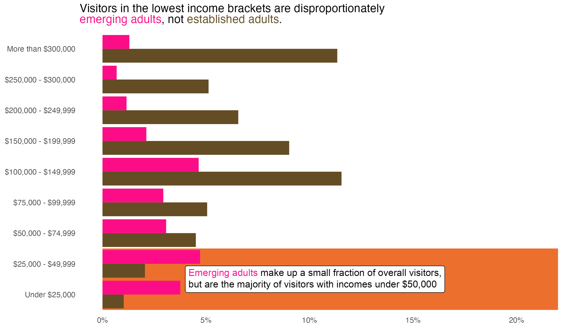
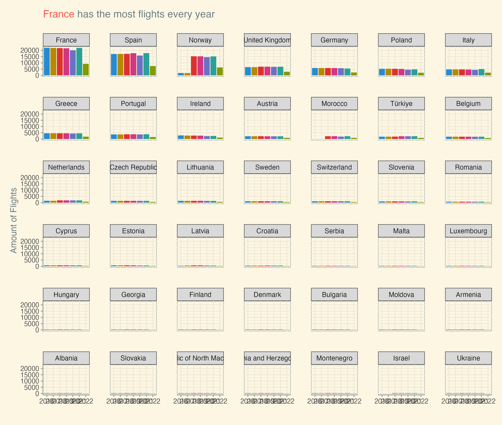
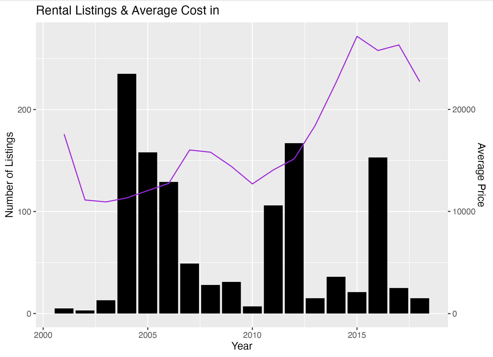
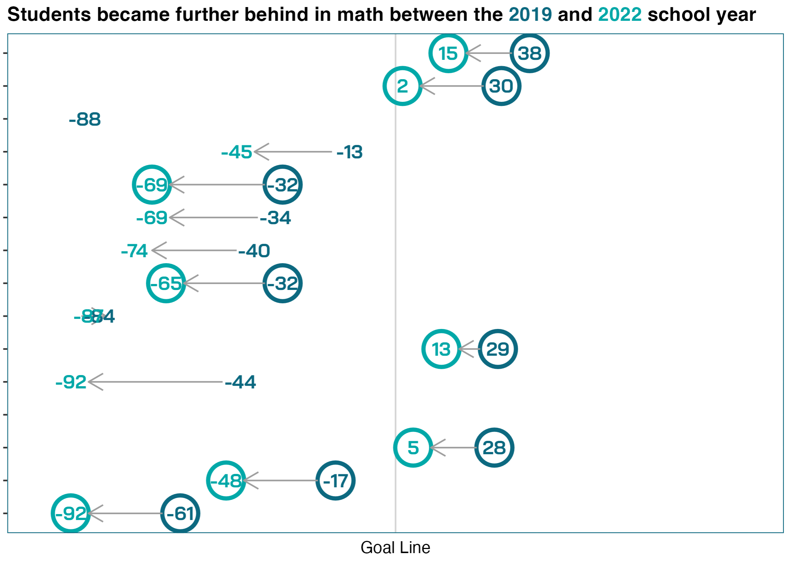
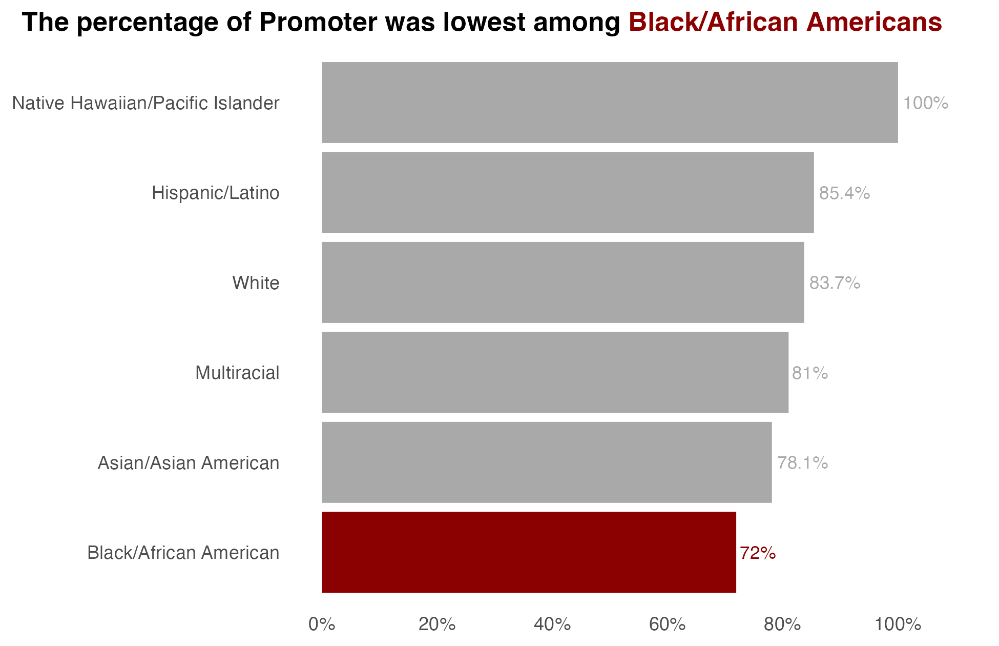

```{r, include=FALSE, eval = TRUE}
options(htmltools.preserve.raw = FALSE)
library(tidyverse)
library(fivethirtyeight)
library(readxl)
library(janitor)
library(patchwork)
library(here)
library(gapminder)
library(gt)
library(ggtext)
library(wakefield)
```

<!-- 

Show parameterised reports.

- Publish online with netlify

-->

# Agenda

--

1. How far you've come

--

1. Where to ask questions

--

1. How to ask good questions

--

1. Twitter and #rstats

--

1. Highlight stuff from everyone!

---

class: inverse, center, middle

# How far you've come

---


## Data Analysis

```{r echo = FALSE, warning=FALSE, message=FALSE, eval=FALSE}
library(googlesheets4)
library(tidyverse)
library(janitor)
library(scales)

pre_survey <- read_sheet("https://docs.google.com/spreadsheets/d/19Ny92IGg0ZzIqiLs7QywaGF-Y85HQZn1iIIXN4I_tpg/edit?resourcekey#gid=1201619159") %>% 
  clean_names()

pre_survey_tidy <- pre_survey %>% 
  select(contains("rate"), contains("terrified")) %>% 
  set_names(c("data_analysis", "visualization", "scared")) %>% 
  pivot_longer(cols = everything()) %>% 
  mutate(timing = "Pre")

post_survey <- read_sheet("https://docs.google.com/spreadsheets/d/1dOVpnbdFOz5swIH1YQCMcF4BWmUX-0g9FIOzSV04O64") %>% 
  clean_names()

post_survey_tidy <- post_survey %>% 
  select(contains("rate"), contains("terrified")) %>% 
  set_names(c("data_analysis", "visualization", "scared")) %>% 
  pivot_longer(cols = everything()) %>% 
  mutate(timing = "Post")

pre_post_plot <- function(area) {
pre_survey_tidy %>% 
  bind_rows(post_survey_tidy) %>% 
  group_by(timing, name) %>% 
  summarize(avg_response = mean(value, na.rm = TRUE)) %>% 
  ungroup() %>% 
  mutate(timing = fct_rev(timing)) %>% 
  mutate(avg_response_formatted = number(avg_response, 0.1)) %>% 
    filter(name == area) %>% 
  ggplot(aes(timing, avg_response,
             color = timing,
             group = 1,
             label = avg_response_formatted)) +
  geom_line(color = "grey") +
  geom_point(size = 10) +
  geom_text(color = "white") +
  theme_minimal(base_family = "Inter") +
  theme(panel.grid.minor = element_blank(),
        axis.title = element_blank(),
        legend.position = "none",
        axis.text.y = element_blank()) +
  scale_y_continuous(limits = c(1, 10),
                     breaks = seq(1, 10, 1)) +
    scale_color_manual(values = rev(c("#6cabdd", "#ff7400")))
}
```

```{r echo = FALSE, warning=FALSE, message=FALSE, dpi = 300, fig.height=3, eval=FALSE}
pre_post_plot("data_analysis")
```

---

## Data Visualization

```{r echo = FALSE, warning=FALSE, message=FALSE, dpi = 300, fig.height=3, eval=FALSE}
pre_post_plot("visualization")
```

---

## How Scared/Excited You Are to Learn R

```{r echo = FALSE, warning=FALSE, message=FALSE, dpi = 300, fig.height=3, eval=FALSE}
pre_post_plot("scared")
```

---

class: inverse, center, middle

# Where to ask questions

---

## Where to ask questions

There are three popular question and answer communities for (R) code questions:

---

## [stackoverflow.com](https://stackoverflow.com)

- This is a general purpose code Q&A website.

- Unfortunately, it has a well-earned reputation for not being welcoming to new users.

---

## [community.rstudio.com](https://community.rstudio.com/)

- This community is run by RStudio and is specifically for R users.

- The admins do work to make the site a welcoming place for all users.

---

## [R for Data Science Learning Community](https://www.rfordatasci.com/)

- Slack community that is very welcoming to newbies

- Has regular office hours where you can get 1-on-1 help

---

## Bonus: [R-Ladies](https://rladies.org/)

- "A worldwide organization whose mission is to promote gender diversity in the R community"

- Extremely welcoming

- Have local chapters that often host events

---

class: inverse, center, middle

# How to ask good (code) questions

---

## How to ask good (code) questions

The most important part of asking good questions about code is to provide **reproducible examples**.

> A **reproducible example** contains all necessary code to reproduce your error or to customise your chart.

The `{reprex}` package is designed to help guarantee your examples are reproducible.

---

## Good code examples are *minimal*

In addition to making your code reproducible you should try to make it *minimal*.

This usually means creating a *minimal* dataset instead of sharing a 9,000 row dataset.

---

## Create datasets with `tribble()`

One of the simplest ways to create minimal datasets is with the `tribble()` function.

This allows you to create datasets by **row** instead of column:

```{r}
tribble(
  ~city, ~customer_type, ~customer_count,
  "Oregon", "Free trial", 10
)
```

---

## Solving your own Qs with `tribble()`

I often discover that by creating reprexes with `tribble()` I end up solving my own question.

.pull-left[
Here's a real life example from several years ago...
]

.pull-right[
```{r, eval=TRUE, echo=FALSE, out.width="350px", dpi=140}
count_party_by_marital <- gss_cat %>%
  count(partyid, marital, name = "n_subcategory") %>%
  group_by(partyid) %>%
  mutate(n_category = n()) %>%
  ungroup() %>%
  mutate(partyid = fct_reorder(partyid, n_category)) %>%
  arrange(desc(n_category))

count_party_by_marital %>%
  ggplot(aes(x = n_subcategory,
             y = partyid,
             fill = marital)) +
  geom_col()
```

]

---

## Create datasets with `{wakefield}`

We mentioned earlier in the course the `{wakefield}` package to create fake datasets:

```{r, eval=TRUE}
set.seed(1980)
r_data_frame(50,
             id,
             name,
             gender_inclusive(x = c("Male", "Female", "Trans", "Nonbinary"),
                              prob = c(50.52, 48.08, 1, 0.4)),
             hair,
             died)
```

---

## Using the `{reprex}` package (I)

The `{reprex}` package includes an "RStudio Addin" that gives you an interactive tool for creating your reproducible examples.


---

## Using the `{reprex}` package (II)

1. Select the code that makes your reprex

1. Open the Addins menu and select "Render reprex..."

1. Choose the options for where you're asking your question

1. Copy and paste the output in the Viewer tab into your question

---

class: inverse, center, middle

# Twitter

---


## Twitter and #rstats

Twitter is a great place to learn about R and to ask (280 character) questions!

The most widely used hashtags are:

- \#rstats for general questions

- \#tidytuesday for tweets about Tidy Tuesday

---

# Palette cleanser

We're covering lots of topics today, so let's take a 2-minute breather.

If you want to take the opportunity to follow us on Twitter please do - and we'll follow you back.

.pull-left[

]

.pull-right[

]

---

class: inverse, center, middle

# Examples from you

---

# Julia's annotated barchart

```{r, include=FALSE}
# Charlie will use this 
msleep %>% 
  count(vore) %>% 
  mutate(vore = fct_relevel(vore,
                            c("carni", "omni", "insecti", "herbi"))) %>% 
  ggplot(aes(x = n,
             y = vore)) +
  geom_col() +
  annotate("rect",
           xmin = 0,
           xmax = Inf,
           ymin = 0,
           ymax = 2.5,
           fill = "orange",
           alpha = 0.3)
```




---

# Ordered faceted chart



```{r, include=FALSE}
# Charlie will use this 
library(gapminder)

gapminder %>% 
  filter(year > 1980) %>% 
  filter(continent == "Europe") %>% 
  ggplot(aes(x = year,
             y = pop)) +
  geom_col() +
  facet_wrap(~ country)
```

---

# Functions and second axes (I)



---

# Functions and second axes (II)

```{r, eval=FALSE}
graph_price_and_postings <- function(city_name) {
  city_rent %>%
    filter(city == "alameda") %>%
    ggplot()  +
    geom_bar(aes(x = year, y = number_postings),
             stat = "identity",
             fill = "black") +
    geom_line(aes(x = year, y = .1 * avg_price),
              stat = "identity",
              color = "purple") +
    labs(title = "Rental Listings & Average Cost in" ,
         x = "Year",
         y = "Number of Listings") +
    scale_y_continuous(sec.axis = sec_axis( ~ . * 100, name = "Average Price"))
}
```

---

# Dumbell chart



---

# ggtext title



---

class: inverse, center, middle

# What happens next

---

## Your feedback

We have a very short post-course survey - [https://forms.gle/mhSr1JuCyLAQwy5P8](https://forms.gle/mhSr1JuCyLAQwy5P8)

--

We'd also like to ask you to record a ~5min video with [loom.com](https://loom.com) about something you've learned thanks to R in 3 Months and submit it on the [final project submission page](https://rfortherestofus.com/courses/r-in-3-months-fall-2022/lessons/rin3-fall-2022-final-project/).


---

## Book 1:1 sessions with Charlie

You can book a 1:1 with Charlie from January 2023 - [https://savvycal.com/charliejhadley-r-for-the-rest-of-us/2nd-1to1-jan-2023](https://savvycal.com/charliejhadley-r-for-the-rest-of-us/2nd-1to1-jan-2023).

---

## Assignment submissions

Charlie will provide feedback on all submissions made before December 31st 2022.

---

class: middle, center, inverse

# Any final questions?


---

class: middle, center

# Thank you for making this fun!

